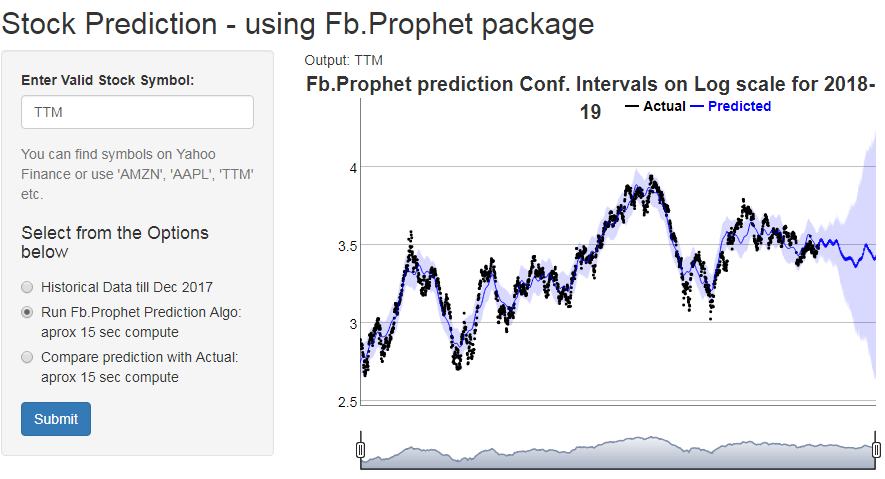

```{r setup, include=FALSE}
knitr::opts_chunk$set(echo = FALSE)
```


## EXECUTIVE SUMMARY

The main objective of this project is to develop a shiny App and host it on shiny platform. This App uses various controls such as Text field, radio buttons and Graphical output as a consequence of user choices.

The main concept I used in this app is to predict stock values using an existing ML algorithm. I have tried ARIMA as well, but I chose to use 'Prophet' algorithm developed by Facebook in this App. For more information refer [Prophet documentation](https://facebook.github.io/prophet/)

The R code used in the analysis can be found here github link [Code Github](https://github.com/pgurav-rgng/DSFinalProject)

### Shiny UI code
```{r eval=FALSE, echo= TRUE}
library(shiny)
library(dygraphs)
shinyUI(fluidPage(
    titlePanel("Stock Prediction - using Fb.Prophet package"),
        sidebarLayout(
        sidebarPanel(textInput("symb", "Enter Valid Stock Symbol:", value = "", width = NULL, placeholder = NULL),
                     helpText("You can find symbols on 'Yahoo Finance' or use 'AMZN', 'AAPL', 'TTM' etc."),
                     radioButtons(inputId = "ptype", label= h4("Select from the Options below"),
                                 choices = list("Historical Data till Dec 2017" = 1, 
                                                "Run Fb.Prophet Prediction Algo: aprox 15 sec compute" = 2,
                                                "Compare prediction with Actual: aprox 15 sec compute" = 3),
                                 selected = 1),
                     submitButton("Submit"),
                     verbatimTextOutput("value")
        ),
        mainPanel(textOutput("text1"),textOutput("text2"),dygraphOutput("dygraph")))
)
)

```


## HOW TO USE
- Run the app from this link [Stock Predict App]( https://pradeepgurav.shinyapps.io/StockPredict)
- You can use Stock symbols like 'AAPL', 'AMZN', 'TTM' etc or find symbols of the stock you are interested in        from [Yahoo Finance](https://in.finance.yahoo.com)
- The Apps behaviour can be checked using following selections sequentially:
  a. See the historical data retrieved from Yahoo Finance source.
  b. See stock prediction by using Facebook's Prophet algorithm 
  c. Compare the prediction with actual stock values for 1 year (Jan to Dec 2018)
  ```{R}
  setwd("C:/Users/pg/Documents/datascience/Projects/finalproj/prophetApp")
  ```
  
  {#id .class width=50% height=30%}


 
## Prediction Algorithm - Facebook Prophet

<small> Prophet is a procedure for forecasting time series data based on an additive model where non-linear trends are fit with yearly, weekly, and daily seasonality, plus holiday effects. It works best with time series that have strong seasonal effects and several seasons of historical data. Prophet is robust to missing data and shifts in the trend, and typically handles outliers well. Prophet is open source software released by Facebook’s Core Data Science team.</small>

Here is some of the server code:

```{r eval=FALSE, echo= TRUE}
      library(quantmod)      
      # Retrieve the Data from Yahoo Finance as source for the time period shown
      data <- getSymbols(
      input$symb,
      src = "yahoo",
      from = "2008-01-01",
      to = "2019-01-01",
      auto.assign = FALSE
      )
      mydf <- data.frame(data[,4])
      mydf <- copy(mydf)
      setDT(mydf, keep.rownames = TRUE)
      colnames(mydf)<- c("ds", "y")
      mydf$ds<-ymd(mydf$ds)
      
      #Prepare tarining data set
      #Leave one year out and use the remaining data for prediction 
      df2017 <- mydf %>%
          filter(ds >= as.Date("2010-01-01") & ds <= as.Date("2017-12-31"))
      #qplot(ds,y, data=df2017, main="Historical Price Chart")
      
      ### Log Transformed data
      ds<-df2017$ds
      y<-log(df2017$y)
      df2017log<-data.frame(ds,y)
      #head(df2017log)
      
      ### Plot of Forecast for Next 365 Days
      m=prophet(df2017log, daily.seasonality = TRUE)
      future<-make_future_dataframe(m, periods=365)
      forecast <-predict(m,future)
      dyplot.prophet(m,forecast,main = "Fb.Prophet prediction Conf. Intervals on Log scale for 2018-19 ") 

```

## Comparing Prediction with actual data

Combining the Prediction with Actual values.

```{r eval=FALSE, echo= TRUE}
dygraph1 <- cbind(df2T, df3T)
dw<-c("2010-01-01", "2018-12-31")
dygraph(dygraph1, main = "Predicted versus Actual reality till Jan 2019") %>% dyOptions(colors = RColorBrewer::brewer.pal(3, "Set2")) %>% dyRangeSelector(dateWindow =dw) %>% dyLegend(show = "never", hideOnMouseOut = FALSE)
```

### Summary

{#id .class width=30% height=20%} 
<small> You can see from this comparison diagram how prediction fits moderately well(correlates with the actual values(test data)). The fitting will vary for different stocks. However one can easily see from the diagram on 2nd page that as the prediction horizon increases (365 days is a long interval for stock prediction) the uncertainty creeps in, with increasing Confidence intervals.

Stock Forecasting is a hard topic because stock prices are affected by multiple factors such as larger trends, wars, pandemics etc. However forecasting using Prophet algorithm could be more accurate for certain data that do not change as drastically as stock values.

There are many packages on R that help in forecasting like ARIMA. Facebook's Prophet model fits additive regression models instead of the traditional ARIMA models.  </small>  

Key benefits of Prophet algorithm are:  
- Manages missing observations very well   
- Manages a large number of outliers  
- Identifies and considers Historical trends in forecasting  


### References

1. [Prophet documentation](https://facebook.github.io/prophet/)
2. [Prophet Repository](https://github.com/facebook/prophet)

 
 


